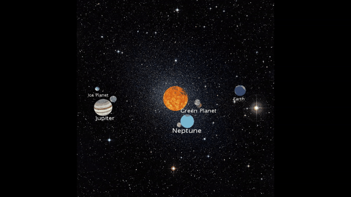

# Sistema Planerario

Este proyecto tiene como objetivo desarrollar un prototipo que muestre un sistema planetario en movimiento.

## Características de la aplicación

- Todos los planetas giran entorno a una estrella.
- En total hay 5 planetas girando alrededor de nuestra estrela.
- Hay un planeta sin estrella, tres planetas con una estrella y uno con dos.
 
## Decisiones
###### Generales
- Se han añadido distintas texturas y fondos para añadir más realismo al prototipo.
- Cada planeta, luna y el sol tiene diferentes formas de moverse, distintas velocidades de movimiento y rotación, etc.

###### Estrella
- Es el centro del sistema.
- En cada rotación se girará 0.25 grados.

###### Planetas
- Hay 5 planetas.
- Tendrá 2 rotaciones rotaciones horizontales:
    - Alrededor del sol.
    - Sobre su propio eje.
- Cada atributo lo controlamos con un array distinto (añadir un planeta nuevo sería añadir una nueva posición al array). Las características de nuestros planetas son:

|Nombre|Ángulo Inicial (posición)|Distancia al origen (%)|Velocidad del planeta|Ángulo Inicial (rotación)| Velocidad de rotación|Tamaño del planeta
|---|---|---|---|---|---|---|
| Neptune  |  100 | 0.25  | 0.25  | 100  | 0.5  |  20 |
| Jupiter  |  20 | 0.34  | 0.1  | 20  | -1.5  |  30  |
| Earth  |  200 | 0.4  | 0.2  |  200 | 1  | 25  |
| Green Planet  | 140  |  0.14 | -0.3  |  140 | 0  |  10 |
| Ice Planet  | 340  | 0.5  | -0.15  | 340  | 0.15  | 10  |

###### Texto sobre planetas
- Podremos ver el nombre de cada planeta debajo del mismo.
- El tamaño del texto será de 22.
- La posición será determinada según el tamaño del planeta. Variará entre 50 para los más grandes y 30 para el más chico.

###### Lunas
- Hay 5 lunas.
- Tendrá 2 rotaciones con centro en el planeta al que pertenece:
    - Respecto al eje X.
    - Respecto al eje Y.
- Cada atributo lo controlamos con un array distinto (añadir una luna nueva sería añadir una nueva posición al array). Las características de nuestras lunas son:

|Planeta al que pertenece| Dintancia al punto de rotación| Velocidad Y | Ángulo Inicial Y|Velocidad X| Ángulo Inicial X|Tamaño|
|---|---|---|---|---|---|---|
| Neptune  |  20 | 0.3  | 0  | -0.4  | 40  | 7 | 
| Jupiter  |  35 | 0.5  | 60  | 0.25  | 120  | 12 | 
| Earth  |  28 | 0.1  | 20  |  -0.4 | 0  | 5 | 
| Green Planet  | -35  |  0.25 |120  |-0.25 | 320  | 10 | 
| Green Planet  | 20  | -1  | 300  | 0.3  | 40  | 3 | 

## Resultado final
A continuación se ve un ejemplo de la aplicación:

## Herramientas utilizadas
- [Editar el readme.md](https://dillinger.io/)
- [Processing](https://processing.org/)

Realizado por [José Juan Reyes Cabrera](https://github.com/JoseJuanRC)
